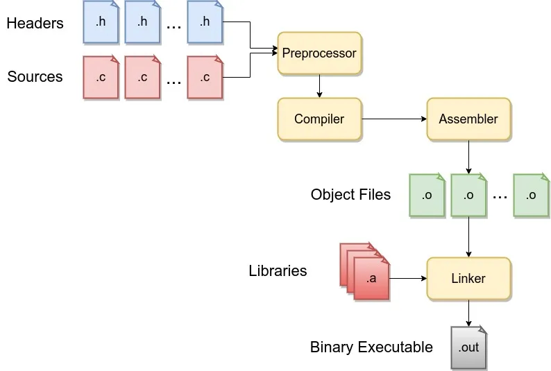
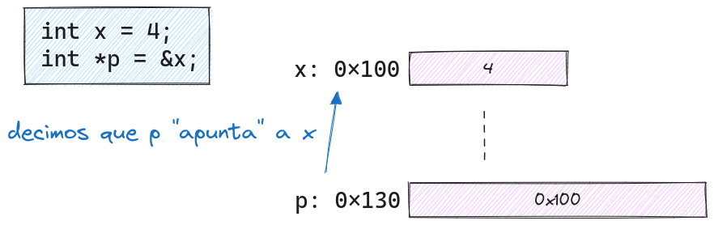
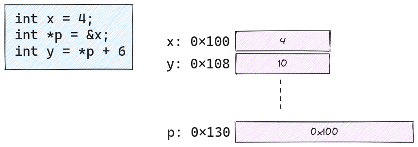
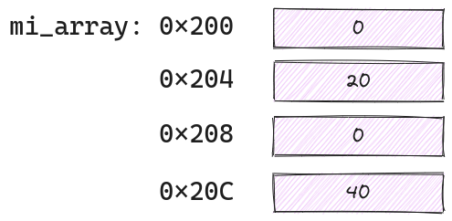
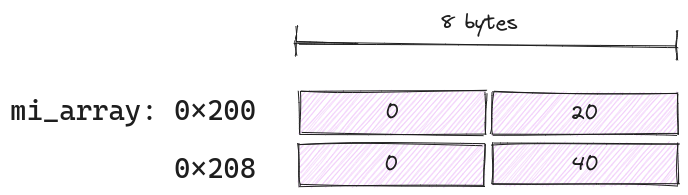

Nociones básicas de C
=====================

Antes de empezar, deben saber que en el directorio **ejemplos** en este repo, disponen de varios programas pequeños que prueban la funcionalidad
de algunas características primitivas del lenguaje. La idea es que vean el código, lo analicen y traten de predecir el resultado de su ejecución. Luego, pueden experimentar y modificar dichos archivos para hacer sus propias pruebas. Esa, consideramos, es la mejor manera de aprender.

Para compilar los ejemplos, ya dentro del directorio `ejemplos`, alcanza con un:

```shell
$ make all
```

o si quieren compilar algún ejemplo en particular, pueden tipear su nombre, por ejemplo:

```shell
$ make strings
```

Para borrar los archivos generados, disponemos del ya clásico

```shell
$ make clean
```

## Tipos de datos

Veamos los tipos de datos enteros nativos de C:

|Tipo|Espacio ocupado| Rango  ||
|---|---|---|---|
|char|1 byte| -128 a 127 ó 0 a 255        |$-2^7$ a $2^7 - 1$ ó $0$ a $2^8 - 1$|
|unsigned char|1 byte| 0 a 255            |$0$ a $2^8 - 1$|
|signed char|1 byte| -128 a 127           |$-2^7$ a $2^7 - 1$|
|short|2 bytes| -32768 a 32767            |$-2^{15}$ a $2^{15} - 1$|
|unsigned short|2 bytes| 0 a 65535        |$0$ a $2^{16} - 1$|
|int| usualmente 4 bytes| -2147483648 a 2147483647     |$-2^{31}$ a $2^{31} - 1$|
|unsigned int| usualmente 4 bytes| 0 a 4294967295     |$0$ a $2^{32} - 1$|
|long| usualmente 8 bytes| -9223372036854775808 a 9223372036854775807     |$-2^{63}$ a $2^{63} - 1$|
|unsigned long| usualmente 8 bytes| 0 a 18446744073709551615     |$0$ a $2^{64} - 1$|

Como vemos, no tenemos garantías absolutas del tamaño en bytes que va a ocupar cada tipo de datos y en el caso de un *plain char*, tampoco tenemos garantía de su *signedness* (signo). El tamaño es dependiente del compilador utilizado para una arquitectura determinada. Lo que sí podemos decir es que *generalmente* en arquitecturas de 64 bits, el **char** es **signed**, el **int** ocupa 4 bytes y el **long** ocupa 8 bytes.

También y para evitar este problema, C dispone de tipos de longitud fija, que deben ser preferidos en donde esta ambigüedad de los largos nos pueda  traer problemas.

Para usarlos debemos incluir `stdint.h` (`#include <stdint.h>`)

Tipos signados:

- **int8_t**  (8 bits con signo)
- **int16_t** (16 bits con signo)
- **int32_t** (32 bits con signo)
- **int64_t** (64 bits con signo)

Tipos sin signo:

- **uint8_t**  (8 bits sin signo)
- **uint16_t** (16 bits sin signo)
- **uint32_t** (32 bits sin signo)
- **uint64_t** (64 bits sin signo)

Usando estos tipos **tenemos garantía** de que el tamaño es el especificado en el nombre del tipo.

### size_t
Existe un tipo de datos llamado `size_t` que puede guardar el tamaño teórico máximo un objeto de cualquier tipo, incluyendo el tamaño de los arrays. Es de tipo **entero sin signo**.

Se suele usar para indexar arrays. También es el tipo resultante del operador `sizeof` (operador que devuelve el tamaño en bytes de un objeto o tipo)

Es una buena práctica usar `size_t` cuando declaramos variables para tamaños como el número de caracteres de un string, el tamaño de un array, etc.

Ejemplo:

```C
int array[34];

size_t len = sizeof(array) / sizeof(int); 
```

En el ejemplo anterior, `len` vale 34, ya que el tamaño del array (en bytes) es: 34 * 4 y el tamaño de un `int` es 4

## Comentarios

Se dispone de 2 tipos de comentarios:

- En bloque: `` /* */ ``
- En línea: ``//``

```C
/* Esto es un comentario en bloque, suele usarse para documentar funciones o módulos 
 * completos. Los asteriscos agregados en el margen izquierdo son puramente cosméticos, 
 * no cumple ninguna función sintáctica, pero se suelen usar porque quedan bien. Un ejemplo
 * abajo
 */

 /* Función count_zeros 
 * 
 * array es un array de ints
 * length es la cantidad de elementos del array
 * 
 * Devuelve la cantidad de ceros presentes en el array
 */
size_t count_zeros(int* array, size_t length){
    size_t ceros = 0; // inicializo en 0 la cantidad de ceros
    for (size_t i=0; i<length, ++i){ 
        if(array[i] == 0){  
            ceros++; // incremento la cantidad de ceros
        }
    }
    return ceros;
}
```

## Declaración de variables

Ya estuvimos viendo algunos ejemplos antes, pero formalmente la sintaxis es:

<pre>
<i>tipo</i> <i><b>nombre_var</b></i> = <i>valor inicial</i>;
</pre>

o

<pre>
<i>tipo</i> <i><b>nombre_var</b></i>;
</pre>


En este segundo caso, puede contener basura dependiendo de donde la definamos

Ejemplos:

```C
uint64_t mi_var = 0;
int mi_int = -985;
uint8_t mi_byte = 24;

int i;
int j = i;
```

### typedef

Sirve para definir un nuevo tipo de dato con un nombre a elección a partir de un tipo de dato ya existente. Usualmente se lo utiliza para construir nombres más cortos o más significativos para tipos ya definidos por C o para tipos que hayan sido previamente declarados. 


La sintaxis es:

<pre>
typedef <i>tipo</i> <i><b>nuevo_nombre</b></i>;
</pre>

<div style="page-break-after: always;"></div>

Ejemplo:

```C++
int main(){

   typedef int edad_t;

   edad_t edad_juan = 23;
   printf("%d\n", edad_juan);

   return 0;
} 
```
Este programa imprimirá una vez compilado y ejecutado:

```output
34
```

En definitiva `typedef` nos deja darle un significado declarativo a nuestro tipo de datos, que tiene que ver más con el uso que le estamos dando en nuestro programa. Además, si en algún momento queremos cambiar el tipo de por ejemplo, las variables que almacenan datos de edad, nos basta con cambiar la declaración en el `typedef` una sola vez.

## Constantes

Hay 2 formas de definirlas:

 * ``const float PI = 3.1415926 ``
 * ``#define PI 3.1415926``
 
La segunda forma es un reemplazo de texto (donde dice PI en el código se reemplazará por el **texto** 3.1415926). Esto ocurre previo a la compilación, donde se invoca a una herramienta llamada **preprocesador**, Esta herramienta se encarga de hacer todos estos tipos de manipulaciones de texto, previo a la compilación. Su uso se denota porque la línea comienza con el carácter `#`. Otro ejemplo típoco donde actúa el preprocesador además de en los `#define` es en los `#include`, que básicamente reemplazan esa línea con el contenido del archivo que se incluye.

## Operadores 

|  Operador |  Significado  |
|---|---|
| ``=`` | Asignación|
|``+ `` |Suma |
| ``-``  | Resta|
| ``sqrt()`` | Raíz cuadrada (debe incluirse `math.h`)
| ``*``  | Multiplicación|
| ``/``  | División|
| ``%``  | Módulo|


* `` x (+, - , * , /)= y ``: Es lo mismo que hacer ``x = x (+, - , * , /) y``

Ejemplo:
```C
x += y; // lo mismo que x = x + y;
x /= y; // lo mismo que x = x / y;
```

* `x % y`: Es el resto de la división entre `x`  e  `y`.
+ `x / y`: Si los dos valores son int, es una división entera. Si alguno de los dos es un float, hace la división con decimales. Si no queremos hacer la división entera y tenemos dos int, podemos castear alguno de los dos a `float` o `double` y hacemos la división. Ejemplo: `float(6) / 10 `. También podemos hacer: `(1.0 * 6) / 10`. Tener en cuenta que esa constante `1.0` se interpreta como un `double` por default. Si queremos que se interprete como un float, podemos escribir `1.0f`.

<div style="page-break-after: always;"></div>

## Control de flujo
### Operadores lógicos

| Operador  | Significado  |
|---|---|
|``==``  | Igual|
| ``!=`` | Distinto|
| ``&&`` | AND |
|``!`` | NOT |
| \|\|   |  OR |
| ``>``   | Mayor|
|``<``   | Menor|
| ``>=`` | Mayor o igual|
| ``<=``| Menor o igual|

Algo a tener en cuenta: los operadores lógicos en C devuelven `0` si el resultado es falso y devuelven `1` si el resultado es verdadero. Nativamente, C no dispone de tipos booleanos del estilo `true` y `false` (como por ejemplo C++ que dispone del tipo `bool`)


### If 
La sintaxis es:

<pre>
if(<i>condición</i>){
    <i>código</i>
}
</pre>

### if - else

La sintaxis es:

<pre>
if(<i>condición</i>){
    <i>código</i>
}
else if (<i>condición</i>){
  <i>código</i>
}
else{
  <i>código</i>
}
</pre>

<div style="page-break-after: always;"></div>

### switch - case

Es una estructura de control que me permite elegir entre varias posibilidades según ciertas condiciones.

Este va a evaluar el valor de la variable en cada `case` y si la condición se cumple, entra en dicho `case` y ejecuta ese bloque y TODOS los que le siguen. Este comportamiento se denomica *fall-through*. Si queremos terminar el case y salir, debemos poner un `break` explícitamente.

En la condición tenemos que poner valores que tengan sentido con respecto al valor de dicha variable, sino nos tirará un error. Sólo funciona con tipos cuya representación sea entera.

La sintaxis es:

<pre>
switch(<i>variable</i>)
{
  case <i>valor_1</i>:
    <i>código</i>
  case <i>valor_2</i>:
    <i>código</i>
  default: 
    <i>este caso es por si no matchea ninguno de los anteriores</i>
}
</pre>

Ejemplo:

``` C++
int main(){

   int dia = 2;

   switch (dia) {

       case (0):
       case (1):
           printf("lunes\n");

       case (2):
           printf("martes\n");

       case (3):
           printf("miercoles\n");
           break;

       default:
           printf("jueves\n");

   }

   return 0;

}
```
Repetimos: ningún case tiene un break implícito. Si se quiere modificar ese comportamiento se debe utilizar `break` (este cortará el `switch` por completo). 

En el ejemplo, vemos que hay un *fall-through* desde el `case (2)` hasta el `case(3)`


```output
martes 
miercoles
```

### Operador Ternario 
Sirve para cuando tenemos un solo `if` y un ``else``. Lo que hace es si la ``condición`` es **verdadera* devuelve la `expresión1`, sino la ``expresión2``. 

Su sintaxis es:

<pre>
<i>condición</i> ? <i>expresión1</i> : <i>expresión2</i>;
</pre>

Ejemplo:

```C++
int main(){

   int i = 2;
   int j = 5;

   int k = i < j ? 1 : 0; 
   int m = i > j ? 1 : 0;

   printf("%d\n", k);
   printf("%d\n", m);

   return 0;

} 
```
Salida:
```output
1
0
```

Curiosamente las líneas

```C
int k = i < j ? 1 : 0;
int m = i > j ? 1 : 0;

```

podrían haberse escrito también como:
```C
int k = i < j;
int m = i > j;
```

¿Por qué?

## Ciclos

### Instrucciones de corte
* break 
* continue
* return 

<div style="page-break-after: always;"></div>

### For

La sintaxis es:

<pre>
for(<i>inicialización de variable</i>; <i>condición</i>; <i>incremento de variable</i>)
{
  <i>código</i>
}
</pre>

Cualquiera de los segmentos puede dejarse en blanco.

La ``inicialización de variable`` se ejecuta una sola vez, luego evalúa la ``condición``. La `condición` se evalúa en todo ciclo, incluyendo el primero y en general es la responsable de que el ciclo termine (salvo que haya un `break`). Si esta se cumple se ejecuta el bloque y luego el `incremento de variable`. Esto se repite hasta que la condición sea falsa y ahí sale del ciclo.

Puede introducirse más de una  `inicialización de variable`  o más de un `incremento de variable` separando las sentencias por coma ``,``.

Ejemplo:

``` C++
for (int i = 0, j = 1; i<10 && j<5 ; i++, j++) {
 ...
}
```

### While

La sintaxis es:

<pre>
while(<i>condición</i>)
{
  <i>código</i>
}
</pre>

### Do - While

La sintaxis es:

<pre>
do
{
  <i>código</i>
}while(<i>condición</i>);
</pre>

<div style="page-break-after: always;"></div>

## Funciones

Prestar especial atención en la siguiente sección la diferencia entre *declaración* y *definición*

### Declaración de funciones

La sintaxis es:

<pre>
<i>tipo</i> <i><b>nombreFuncion</b></i> (<i>tipo</i> <i><b>arg1</b></i> , <i>...</i>);
</pre>

Las funciones, en la mayoría de los casos, deben ser declaradas antes de ser utilizadas.  Los nombres de los argumentos son opcionales en las declaraciones.
Indicamos que es una declaración porque termina en `;`. Una vez declarada, nos queda definirla.

### Definición de funciones 

La sintaxis es:

<pre>
<i>tipo</i> <i><b>nombreFuncion</b></i> (<i>tipo</i> <i><b>arg1</b></i> , <i>...</i>)
{
    <i>código</i>
}
</pre>

Ejemplo:

``` C++
int cuad(int n) {
    return n * n;
}
``` 

Si en una función no queremos que devuelva nada utilizamos como tipo de dato void:

```C++
void func() {

   printf("%d\n", 5);  // no devuelve nada

}
```
Salida:
```output
5
```

Una cuestión técnica: las funciones no necesitan ser definidas para que el archivo pueda compilar correctamente, solo necesitan ser declaradas. Sin embargo, cuando querramos armar el archivo ejecutable, el linker buscará en todos los archivos objeto (los .o) que le pasemos por la definición de dicha función. En caso de no encontrar una definición, nos devovlerá un error del tipo `undefined reference` o similar.

Si una función ha sido previamente declarada, debe ser definida con el mismo valor de retorno y tipos de argumentos, pero los nombres de los parámetros no necesitan ser los mismos, en la declaración y en la definición, aunque es recomendable que lo sean, por razones de claridad.

Otra cosa a tener en cuenta es que una entidad en C puede ser declarada muchas veces pero sólo puede ser definida una sola vez. Las múltiples declaraciones que el compilador encuentre de la misma entidad tienen que ser compatibles entre sí.


### Ciclo de compilación

Ahora que vimos funciones, podemos ver el proceso de compilación de C



Como se puede observar, todo empieza con una serie de módulos `.c` y header files `.h`. El objetivo de los header files es contener sólo declaraciones, de manera que den a conocer ciertas entidades a los módulos que los incluyan (con la directiva de preprocesador `#include`). El preprocesador resolverá todas sus directivas (`#include`, `#define`, etc) y terminada su fase, entregará una serie de archivos .c al compilador.
Estos archivos, son compilados uno a uno, por separado en un proceso conocido como *compilación separada*. 

Cada archivo compilado, genera un archivo objeto, convencionalmente con el mismo nombre, pero con extensión `.o`. Cada uno de estos archivos, hasta el momento, no sabe de la existencia del resto. Es más, podemos estar utilizando en un archivo una función o variable **definida** en otro. El compilador solamente mira que estemos haciendo un uso correcto de la función (que pasemos bien sus parámetros, en orden, tipo y número y que recibamos el valor de retorno con el tipo correcto). Para eso sólo necesita saber la "firma" o "prototipo" de una función, que es básicamente la información que nos brinda la **declaración** de la misma.

El proceso continúa con el **linker**, que se encarga de armar un único archivo binario(ya sea un ejecutable o una biblioteca), a partir de todos los archivos `.o` y de referencias a funciones que se encuentren en otras bibliotecas, propias del sistema. Es en este momento, en donde se resuelve que el llamado de una función desde un archivo vaya al código contenido en el otro. El linker se encarga de armar y resolver todas las referencias a funciones y variables que hasta el momento venían siendo "promesas" de que se encontraban en otro lado. Una vez armado y resueltas todas las referencias, el linker ensambla un archivo ejecutable, listo para que el sistema operativo, a través un módulo llamado **loader**, pueda ejecutar el programa correctamente.

<div style="page-break-after: always;"></div>

## Punteros 

Hemos llegado a una de las funcionalidades de C que lo que distingue de otros lenguajes: punteros. Pero, ¿Qué es un puntero? Básicamente, un puntero es una variable que almacena el valor de memoria de otra entidad. Esta otra entidad puede ser otra variable, una función, otro puntero, etc. Incluso puede almacenar posiciones de memoria *raw*, es decir, que el puntero per sé no tenga noción de a qué está apuntando, simplemente sabe que tiene una posición de memoria almacenada. Esa posición puede ser válida o inválida incluso, recae en nosotros saber a qué está apuntando realmente nuestro puntero.

Ejemplo:

``` C++
int x = 4;       // variable normal
int *p = &x;     // obtiene la dirección de memoria de x y la almacena en el puntero p
``` 



 * `x` es una variable de tipo entera (`int`) que ocupa 4 bytes.
 * `p` es una varible de tipo puntero a entero (`int *`) que ocupa 8 bytes

 Notar que sin importar el tipo apuntado, los punteros ocupan SIEMPRE 8 bytes en una arquitectura de 64 bits. Esto es así porque las direcciones de memoria son de 8 bytes en dicha arquitectura. En una arquitectura de 32 bits, los punteros ocupan 4 bytes.

```C++
size_t size = sizeof(int*); // size es 8 en una arquitectura de 64 bits y 4 en una de 32 bits
```

## Desreferenciación de punteros 

``` C++
int y = *p + 6;  // y resulta en el valor 10. Se usa el operador "*" para desreferenciar un puntero
``` 



 * El asterisco desreferencia el puntero. Notar la diferencia en el uso del asterisco en la declaración y como operador.
 * El valor de la expresión `*p` es el valor de la variable cuya dirección de memoria es apuntada por el identificador. Se usa el operador `&`, *address-of*.
 
 En este caso p es un puntero que contiene la dirección de la variable `x`. Si quiero acceder al valor contenido en `x`, hago `*p` (tanto para lectura de dicho valor, como para escritura)

 Es decir, con un puntero podemos acceder indirectamente al valor de otra variable, tanto para leerlo, como para escribirlo. Esto último, tiene una utilidad subyacente muy grande: si queremos pasar a una función, un parámetro que en realidad es un objeto pesado (piensen en un array, por ejemplo), podemos pasar un puntero y entonces, ¡lo único que se va a copiar es el valor del puntero! La función puede acceder a los valores del array sin problemas, a través del puntero y nos evitamos tener que copiar un montón de memoria de manera ineficiente.

### Puntero a NULL

``` C++
int *px = NULL;
``` 

Básicamente, un puntero a NULL es un puntero que no apunta a nada. Es decir, no tiene una dirección de memoria válida. Esto es útil para inicializar punteros y luego chequear si apuntan a algo o no. Si no apuntan a nada, podemos decir que están *libres* y podemos asignarles una dirección de memoria válida.

Un puntero a NULL y un puntero no inicializado son diferentes, ya que el puntero no inicializado puede apuntar a cualquier dirección de memoria, incluso a una dirección de memoria válida. En cambio, un puntero a NULL no apunta a nada.

Notar que curiosamente, podemos inicializar un puntero con el valor 0, pero con ningún otro valor:

```C++
int *pi = 0; // es lo mismo que int *pi = NULL;
pi = NULL    // también es válido
pi = 100;    // esto no es válido
pi = num;    // esto tampoco es válido
```

Un ejemplo de cómo se puede usar el valor del puntero a NULL, sería:

```C++
if(pi){
    // pi no es NULL
}
else{
    // pi es NULL
}

```

De esta manera, podemos saber si el puntero tiene un valor válido o no.

No confundir NULL con el carácter nulo. El carácter nulo es el carácter `\0` y es un carácter como cualquier otro. NULL es un puntero que no apunta a nada.

### Puntero a void

``` C++
void* p = NULL;
```

Un puntero a void es un puntero que no tiene tipo. Es decir, no sabemos a qué tipo de dato apunta. Esto es útil para cuando queremos pasar un puntero a una función, pero no sabemos a qué tipo de dato apunta. Por ejemplo, si queremos pasar un puntero a una función que imprime la dirección de memoria a la que apunta, podemos hacer:

```C++
void print_value(void* p){
    printf("%x\n", p); // Imprimimos la dirección a la que apunta el puntero p en hexadecimal
}
```

Un puntero a void nunca será igual a ningún otro puntero. Sin embargo, dos punteros a void que apunten a NULL, serán iguales.

```C++
int num;
int *pi = &num;
printf("Valor de pi: %x\n", pi); // imprime la dirección de memoria de num en hexadecimal
void *pv = pi;
pi = (int*) pi; // cast a puntero a int
printf("Valor de pi: %x\n", pi); // imprime la dirección de memoria de num en hexadecimal
```

Cuando ejecutamos esto, podemos comprobar que el valor de los punteros es el mismo:

```output
Valor de pi: 7fffbf7c
Valor de pi: 7fffbf7c
```

La lógica detrás del uso de punteros se entiende mejor a través de ejemplos concretos. Traten de mantener en mente estas nociones básicas y sigamos avanzando. Pronto se irán aclarando los conceptos.

## Arreglos
### Declaración de arreglos

La sintaxis es:

<pre>
<i>tipo de dato</i> <i><b>nombre_arr</b></i> [ <i>tamaño_arr</i> ] = {<i>lista inicialización</i>}
</pre>

Ejemplo:

``` C++
int mi_array[4] = { [1]=20, [3]=40 }; // define [0, 20, 0, 40]
int mi_array[] = {0, 20, 0 , 40};     // define [0, 20, 0, 40]
int mi_array[4] = {0, 20, 0 , 40};    // define [0, 20, 0, 40]

int otro_array[4] = {}; // define [0, 0, 0, 0]
``` 



Otra forma equivalente de ver el mismo array en memoria sería:




### Acceso a elementos del arreglo

La sintaxis para acceder a los elementos de un array es:

<pre>
<i><b>nombre_arr</b></i>[<i>index</i>];
</pre>

Ejemplo:

```C++
int arr[7];

for(size_t i=0; i<7; ++i){
    arr[i] = i;
}
```

### Equivalencia entre punteros y arreglos

En C, los arreglos son punteros. Esto quiere decir que un array es un puntero a la dirección de memoria del primer elemento del array. Esto es así porque los arrays son contiguos en memoria, por lo tanto, si tenemos la dirección de memoria del primer elemento, podemos calcular la dirección de memoria del segundo elemento, sumando el tamaño del tipo de dato del array. Si tenemos la dirección de memoria del segundo elemento, podemos calcular la dirección de memoria del tercer elemento, sumando el tamaño del tipo de dato del array, y así sucesivamente.

Ejemplo:

```C++
int arr[7] = {1,2,3,4,5,6,7};
int *p = arr; // p apunta a la dirección de memoria del primer elemento del array

printf("%d\n", *p); // imprime 1
printf("%d\n", *(p+1)); // imprime 2
printf("%d\n", *(p+2)); // imprime 3
printf("%d\n", p[4]); // imprime 5
```

Acá tenemos que prestar atención a varias cosas:
* `p` es un puntero a int, por lo tanto, al hacer `p+1` estamos sumando 4 bytes a la dirección de memoria de `p` (en una arquitectura de 64 bits)
* `p` apunta a la dirección de memoria del primer elemento del array, por lo tanto, al hacer `p+1` estamos apuntando a la dirección de memoria del segundo elemento del array
* `p[4]` es equivalente a `*(p+4)`, es decir, estamos accediendo al quinto elemento del array

Con lo cual una conclusión importante sería que la notación de corchetes, es equivalente a la notación de punteros. Esto es así porque el compilador, cuando ve que estamos accediendo a un elemento de un array, lo que hace es calcular la dirección de memoria del elemento que queremos acceder y luego desreferenciarla. Es decir, cuando hacemos `p[4]`, el compilador lo que hace es calcular la dirección de memoria del quinto elemento del array y luego desreferenciarla. Esto es equivalente a hacer `*(p+4)`.

```C++
p[0] == *(p+0) == *p
p[1] == *(p+1)
...
p[n] == *(p+n)
```

Esto es sumamente importante, ya que nos permite pasar arrays a funciones, sin tener que copiarlos. Si pasamos un array a una función, lo que estamos pasando es un puntero a la dirección de memoria del primer elemento del array. Por lo tanto, la función puede acceder a los elementos del array sin problemas, a través del puntero y nos evitamos tener que copiar un montón de memoria de manera ineficiente.

Un ejemplo de lo anterior sería:

```C++
void print_array(int *arr, size_t length){
    for(size_t i=0; i<length; ++i){
        printf("%d\n", arr[i]);
    }
}
```

Notar como el primer argumento es un puntero a int. Esto es equivalente a un array de int. Por lo tanto, podemos pasarle un array de int sin problemas. Y el segundo argumento es el tamaño del array. Esto es necesario porque el puntero no sabe cuántos elementos tiene el array. Por lo tanto, tenemos que pasarle el tamaño del array a la función.

## Strings

La sintaxis es:

<pre>
char <i><b>nombre_str</i></b> [<i>cantidad_elementos</i>] = <i>inicializador</i>;
 </pre>

El tamaño de un string es la cantidad de caracteres que tiene el string, más el caracter nulo `\0`. Por lo tanto, si queremos almacenar un string de 5 caracteres, tenemos que reservar 6 bytes de memoria.

Ejemplo:

``` C++
int main(){

   char cadena[] = "hola"; // equivalente a {'h', 'o', 'l', 'a', '\0'}

   printf("%s\n", cadena);

   return 0;

}
``` 

```output
hola
``` 

Notar que la notación entre comillas dobles `""` es equivalente a la notación entre llaves `{}`. Esto es así porque el compilador, cuando ve que estamos inicializando un array de caracteres con una cadena de caracteres, lo que hace es inicializar el array con los caracteres de la cadena, más el caracter nulo `\0`.

<div style="page-break-after: always;"></div>

Para comparar cadenas:

``` C++
char s1[] = "hola";

char s2[] = "hola";

if (strcmp(s1, s2) == 0) {...}

``` 

Cuando pasamos un array a una función, no es necesario que le pasemos el tamaño del array, ya que el array contiene el caracter nulo `\0` al final. Por lo tanto, la función puede saber cuál es el tamaño del array, leyendo el array hasta encontrar el caracter nulo `\0`.

Ejemplo:

```C++
void print_string(char *str){
    for(size_t i=0; str[i] != '\0'; ++i){
        printf("%c", str[i]);
    }
    printf("\n");
}
```

Obviamente si el array no se encuentra bien formado, es decir, no tiene el caracter nulo `\0` al final, la función no va a saber cuál es el tamaño del array y va a seguir leyendo memoria hasta encontrar el caracter nulo `\0`. Esto es un comportamiento indefinido y puede llevar a errores de ejecución.


## Estructuras
### Definición de estructuras

La sintaxis es:

``` C++
typedef struct s_nombreStruct { // s_ no es necesario pero se suele usar
	<tipo de dato> atributo_1;
    // ...
    <tipo de dato> atributo_n;
} nombreStruct_t;
```

### Declaración de punteros a estructuras

La sintaxis es:

``` C++
struct_nombre_t* nombreInstancia = (struct_nombre_t*)malloc(sizeof(struct_nombre_t));
``` 

### Acceso a atributos a estructura (cuando no es puntero)

La sintaxis es:

``` C++
nombreInstancia.structAtributo;
```

### Acceso a atributos a puntero de estructura

La sintaxis es:

``` C++
punteroInstancia -> structAtributo;
```

<div style="page-break-after: always;"></div>


## Malloc
En C/C++, `malloc` es una función utilizada para asignar memoria dinámica en el heap durante el tiempo de ejecución de un programa. Permite reservar un bloque de memoria de tamaño específico y devuelve un puntero a la dirección base de ese bloque.¿

Existen varias razones por las cuales se utiliza `malloc` en C/C++:

 * **Ciclo de vida de los datos:** La memoria asignada con `malloc` persiste hasta que se libera explícitamente mediante la función `free`. Esto permite que los datos persistan más allá del ámbito de una función, lo que es útil cuando se necesita compartir datos entre diferentes partes del programa
 * **Tamaño de memoria dinámica:** A diferencia de la memoria estática (declarada en tiempo de compilación), la memoria asignada con `malloc` es dinámica y puede ajustarse durante la ejecución del programa. 

Es importante tener en cuenta que con la ventaja de la flexibilidad que proporciona `malloc`, también surgen responsabilidades adicionales. Cuando se utiliza `malloc`, el programador es responsable de liberar la memoria asignada cuando ya no es necesaria, utilizando la función `free`. Si no se libera la memoria adecuadamente, puede provocar pérdidas de memoria (memory leaks) y agotamiento de los recursos del sistema. Además, el uso incorrecto de `malloc` puede llevar a problemas de seguridad, como desbordamientos de búfer, si no se gestiona correctamente el tamaño y la manipulación de los datos almacenados en la memoria asignada.

Casos:

```C++
int* func(int num){

  int* array[num];

  //...

  return array;
}
```


<div style="page-break-after: always;"></div>

En el ejemplo hay 2 problemas:

 * Al no tener `array` un tamaño fijo, luego `num`puede tomar un valor muy grande que el stack no soporte.
 * Cómo `array` se inicializa en la función `func`, este se guarda en el stack relativo de esta función. Luego, después de hacer toda la ejecución, antes de retornar `array`, el stack elimina todo lo que  se definió durante la ejecución de esta función, por lo tanto, `array` se va a eliminar. Esto quiere decir que vamos a devolver un puntero que no existe.

En síntesis, lo que sucede es que el puntero apunta a la dirección de memoria donde está ubicado el dato. Este a su vez, como se instanció en la función, se va a almacenar en el stack. No obstante, al finalizar la función, el stack libera todas las variables definidas dentro de ella. En consecuencia, si intentamos devolver ese puntero, se generará un error, ya que se trata de una dirección de memoria que ha sido liberada y, por ende, no se puede acceder a ella.

Por lo tanto hay que declararla en el heap con Malloc:

``` C++
int* func(int num){

  int* array = malloc(sizeof(int) * num);

  //...

  return array;

}
```   

Si la queremos liberar en la ejecución de la misma función:

``` C++
void func(int num){

  int* array = malloc(sizeof(int) * num);

  //...

  free(array);

  return;

}
``` 